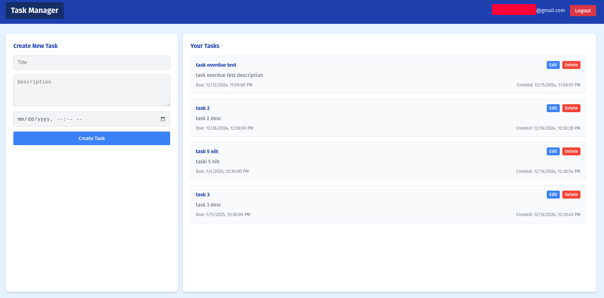
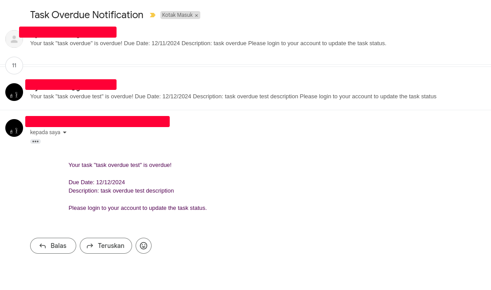

# task manager

task manager app where you can create, update, delete and manage your tasks.

live demo : https://challenge-1-ba851.web.app/

contact me to get user and password 

### preview  

### features
- authentication using email and password
- create, update, delete and manage tasks
- only authenticated users can create, update, delete and manage tasks
- users can only access their own tasks
- validate title and description using firebase functions
- send notification email to the user when a task is overdue. Checking overdue tasks is done every day at 00:00
- real time capability to instantly reflect changes in the task list without refreshing the page
- task list is ordered by due date (ascending)

### run locally
- clone this repository
- go to root directory
- make sure to use node version 22.12.0. you can use nvm to change node version 
- npm install
- setup env for firebase config in root directory
- npm run dev

### update firebase functions 
- npm install -g firebase-tools
- firebase login
- setup env file for firebase function in folder functions
- update functions code in functions/index.js
- firebase deploy --only functions  

### deploy
- npm run build
- firebase deploy

### technologies
- react.js -> to build the user interface
- npm -> to manage dependencies (v 22.12.0)
- vite -> to build the project
- firebase auth -> to handle user authentication
- firebase firestore -> to store and retrieve task data
- firebase functions -> to handle server-side logic
- firebase hosting -> to deploy the web app
- AWS SES -> to send email notifications

### challenge
- challenge : first time develop frontend app, first time using react.js, first time using all firebase services, and first time using AWS SES
- use chatgpt to explore and get early understanding of how each of those technologies work and how to use them
- use windsurf IDE (claude sonnet 3.5) to build the app and find solution when facing bugs 
- sometime, chatgpt or claude sonnet 3.5 doesn't give the right answer about firebase due to version mismatch, so reading firebase documentation still really help

